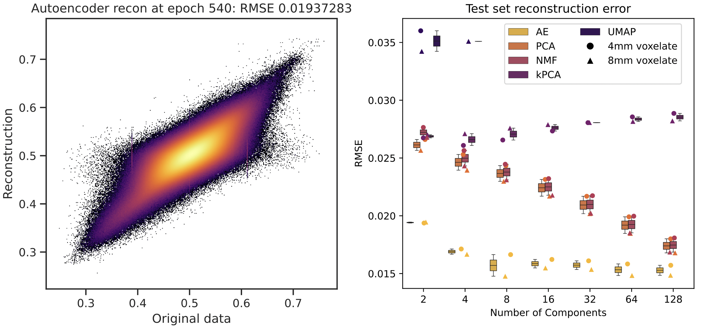
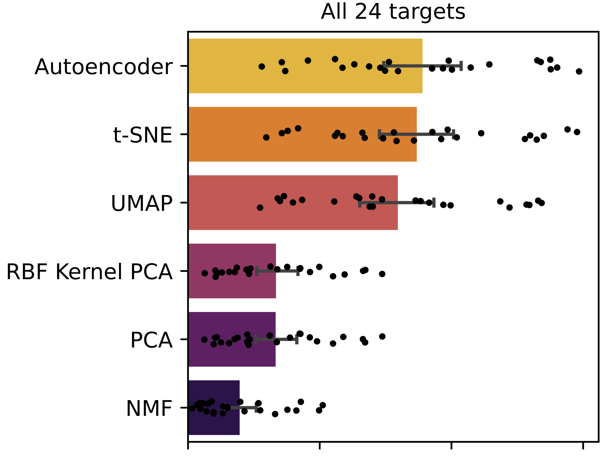
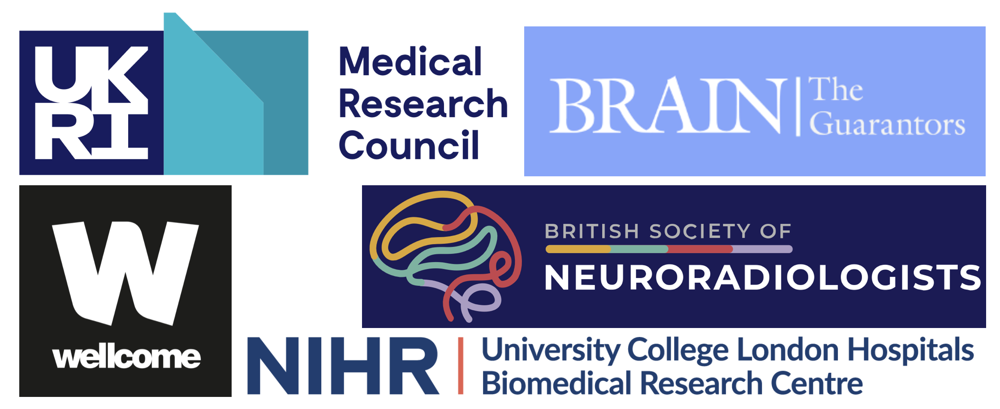

# Compressed Transcriptomics


This repository open sources code and model weights for automated optimum compression of brain transcriptomic data using deep autoencoding, as detailed in our [article](https://doi.org/10.1002/hbm.26795).

## Table of Contents
- [What is this repository for?](#what-is-this-repository-for)
- [Why should I use this model?](#why-should-i-use-this-model)
    - [Expressivity](#expressivity)
    - [Accuracy](#accuracy)
    - [Downstream inference](#downstream-inference)
- [Usage instructions](#usage-instructions)
- [Use queries](#use-queries)
- [Citation](#citation)
- [Funding](#funding)

## What is this repository for?
- The architecture of the brain is too complex to be intuitively surveyable without the use of *compressed representations* that project its variation into a compact, navigable space. 
- The task is especially challenging with high-dimensional data, such as transcriptomic / gene expression data (for example provided by the [Allen Brain Atlas](https://portal.brain-map.org)) where the joint complexity of anatomical and transcriptional patterns demands maximum compression. 
- The **current established practice** is to use standard principal component analysis (PCA), which comes at the cost of *limited expressibility*, which can impact quality of research findings.
- **As an alternative, we here provide the [code](Usage_Tutorial.ipynb) and [model weights](/model_weights) for a series of trained deep auto-encoders.**

## Why should I use this model?
### Expressivity

Even when reducing *15,633 gene expression values into merely 2 components*, note the intricate variational structure across auto-encoded (AE) representations, especially in comparison to methods such as PCA, kPCA, or NMF.   

### Accuracy

Across a number of possible latent dimensionalities, the auto-encoder achieves superior accuracy in reconstructing original source transcriptomic data in comparison to UMAP, PCA, NMF, and kPCA.

*N.B. source reconstruction evaluation is presently not possible using t-SNE.*

### Downstream inference

Deep auto-encoders yield superior predictive utility across signalling, microstructural, and metabolic targets in applied machine prediction using transcriptomic data. 

## Usage instructions
In the uploaded [Jupyter Notebook](Usage_Tutorial.ipynb) we provide a tutorial that:
- 1. Overviews running inference to compress transcriptomic data into an auto-encoded latent space of 2,4,8,16,32,64, or 128 dimensions.
- 2. Provides the code and architecture to retrain the a auto-encoder for use with other data.

The model weights are open-sourced [here](/model_weights).

The NIFTI images depicting the two component latents of all models in both 4mm and 8mm space are open-sourced [here](/niftis).

## Use queries
Via github issue log or email to j.ruffle@ucl.ac.uk.

## Citation
If using these works, please cite the following [paper](https://doi.org/10.1002/hbm.26795):
```
Compressed representation of brain genetic transcription. James K Ruffle, Henry Watkins, Robert J Gray, Harpreet Hyare, Michel Thiebaut de Schotten, Parashkev Nachev. Human Brain Mapping, 2024. DOI https://doi.org/10.1002/hbm.26795. 
```

## Funding
The Medical Research Council; The Wellcome Trust; UCLH NIHR Biomedical Research Centre; Guarantors of Brain; British Society of Neuroradiology.

