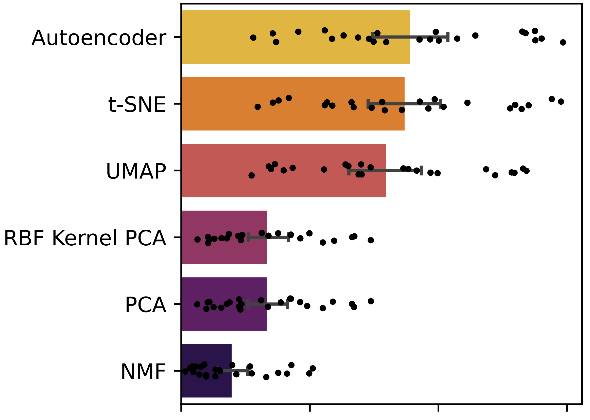

# Compressed Transcriptomics
This repository open sources code and model weights for automated optimum compression of brain transcriptomic data using deep auto-encoding, as detailed in the article [article](URL).

## Table of Contents
- [What is this repository for?](#what-is-this-repository-for)
- [Usage instructions](#usage-instructions)
- [Downstream inference](#downstream-inference)
- [Retraining](#retraining)
- [Usage queries](#usage-queries)
- [Citation](#citation)
- [Funding](#funding)

## What is this repository for?
Compressed transcriptomics...

## Usage instructions
1. X

## Downstream inference
Downstream prediction

## Usage queries
Via github issue log or email to j.ruffle@ucl.ac.uk

## Citation
If using these works, please cite the following [paper](URL):

*Citation here*

## Funding
The Medical Research Council; The Wellcome Trust; UCLH NIHR Biomedical Research Centre; Guarantors of Brain.

